# Portfolio 
Hi! This is the repo for my personal site.
<a href="https://www.wilbertcastillo.com/" target="_blank">Portfolio</a>

Considerations:
* Infrastructure as Code: 
Complete AWS environment (Network, Storage, CDN) provisioned in seconds via Terraform.

* Hybrid Cloud Automation: 
Custom Terraform logic that automates the handshake between Cloudflare DNS and AWS Certificate Manager.

* Zero-Touch Deployment: 
Commits to main automatically build the Astro site, sync to S3, and invalidate global edge caches.

* Enterprise Security: 
S3 bucket has no public access; content is served exclusively through strict HTTPS via CloudFront.

```mermaid
graph TD
    %% Actors
    User(["👤 Visitor"])
    Dev(["👨‍💻 Developer"])
    
    %% Tools & CI/CD
    subgraph Development ["Development & Automation"]
        Gemini["✨ Gemini AI <br/>(Assistance)"]
        Repo["GitHub Repository <br/>(Astro Source)"]
        Actions["🚀 GitHub Actions <br/>(CI/CD Pipeline)"]
        TF["🏗️ Terraform <br/>(Infrastructure as Code)"]
    end

    %% External DNS
    subgraph DNS ["DNS Layer"]
        CF["☁️ Cloudflare <br/>(DNS & Validation)"]
    end

    %% AWS Cloud
    subgraph AWS ["AWS Cloud Infrastructure"]
        ACM["🔒 ACM <br/>(SSL Certificate)"]
        CF_Dist["⚡ CloudFront <br/>(Edge CDN)"]
        S3["🗄️ S3 Bucket <br/>(Private Storage)"]
        OAC["🔑 Origin Access Control <br/>(Security)"]
    end

    %% Relationships - Development Flow
    Dev -- "1. Writes Code" --> Repo
    Dev -- "Assists" --> Gemini
    Dev -- "2. Provisions" --> TF
    
    TF -- "Creates/Manages" --> S3
    TF -- "Configures" --> CF_Dist
    TF -- "Automates Validation" --> CF

    Repo -- "3. Triggers" --> Actions
    Actions -- "4. Builds Site" --> Actions
    Actions -- "5. Syncs Files" --> S3
    Actions -- "6. Invalidates Cache" --> CF_Dist

    %% Relationships - Infrastructure Logic
    CF -- "Validates ownership" --> ACM
    ACM -- "Provides SSL" --> CF_Dist
    CF_Dist -- "Authenticates via" --> OAC
    OAC -- "Allows Access" --> S3

    %% Relationships - User Traffic Flow
    User -- "https://wilbertcastillo.com" --> CF
    CF -- "Resolves CNAME" --> CF_Dist
    CF_Dist -- "Serves Cached Content" --> User
    
    %% Styling
    classDef aws fill:#FF9900,stroke:#232F3E,color:white;
    classDef cloudflare fill:#F38020,stroke:#232F3E,color:white;
    classDef dev fill:#326CE5,stroke:#232F3E,color:white;
    classDef user fill:#232F3E,stroke:#fff,color:white;

    class S3,CF_Dist,ACM,OAC aws;
    class CF cloudflare;
    class Actions,Repo,TF,Gemini dev;
    class User,Dev user;
```

<a href="https://www.wilbertcastillo.com/" target="_blank">Portfolio</a>

